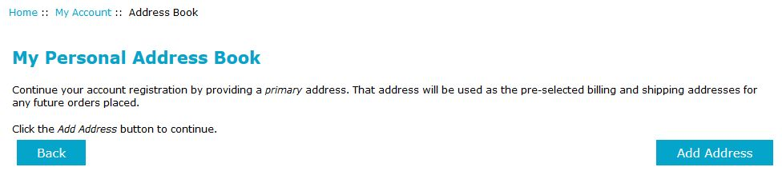

# *Address-Book* Page Modifications #

When a store has enabled the *OPC*'s *registered-account* handling (setting ***Configuration->One-Page Checkout Settings->
Enable Account Registration?*** to *true*) and a customer completes their account-registration, the customer has created an account &hellip; but not yet supplied any address information.  When a registered-account holder navigates to their `address_book`, they're shown a modified version of that page since they've not yet supplied an address.  Clicking the "Add Address" button takes them to the normal address-book entry page where they can supply this information.

----------

----------

The language-text associated with the changes is found in `includes/languages/english/address_book_register.php` and the page-template is found in `includes/templates/template_default/templates/tpl_address_book_register.php`.
