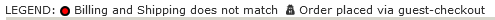
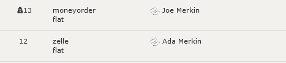

# Admin: Identifying Orders Placed by Guests #

The *One-Page Checkout* admin observer class provides updates to the admin's **Customers :: Orders** page's orders' listing.  At the very top of the listing, the Legend is updated to identify the guest-placed icon:

and each guest-placed order is shown with that icon:

