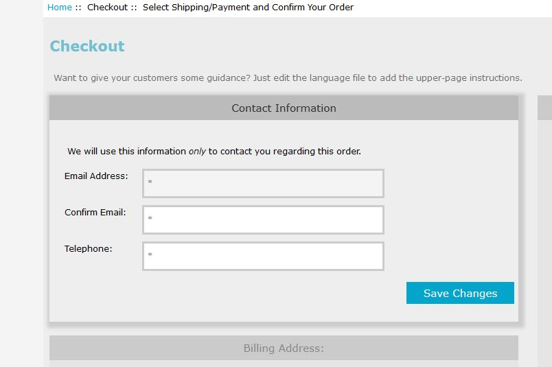
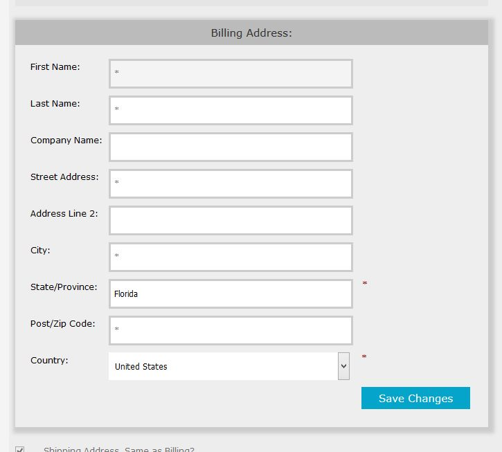
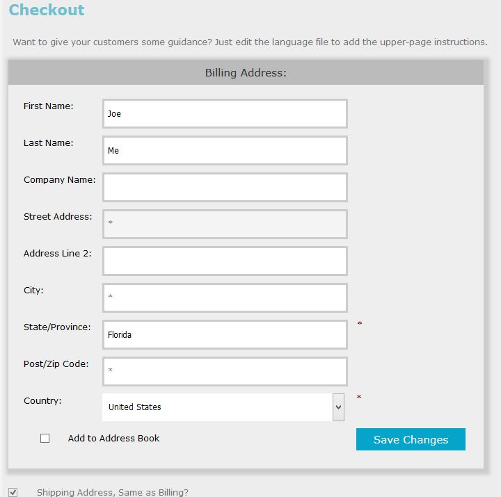
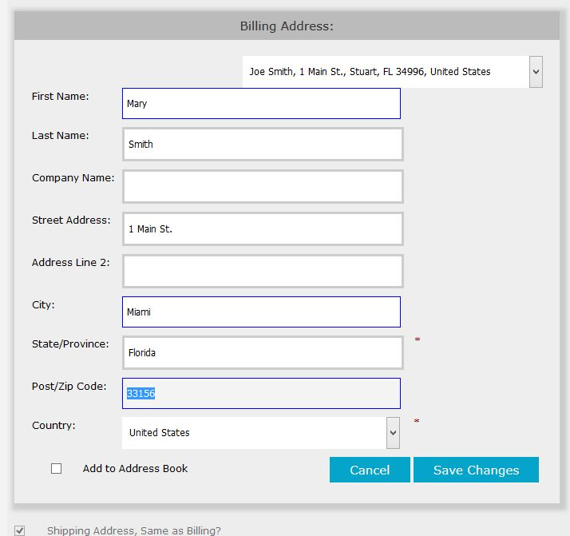

# *Checkout One* Page #

*OPC-GC/RA*'s `checkout_one` page guides a customer through the checkout process using jQuery and AJAX handlers.  The majority of this page's display is documented in the plugin's readme; this section identifies the changes specific to the support for guest-checkout and temporary addresses.

## Gathering Contact Information ##

When a *guest-customer* starts the checkout process, the first step is to gather some *contact information*.  The `checkout_one` page's jQuery gives focus to the "Contact Information" block, requiring that the customer supply this information before proceeding.

----------

----------

There are a couple of optional elements displayed with this block:

1. ***Confirm Email***.  Displayed when the store has set the *OPC*'s configuration setting **Guest Checkout: Require Email Confirmation?** to *true*.
1. ***Date of Birth***.  Displayed when the store has set **Configuration->Customer Details->Date of Birth** to *true*.

While the ***Telephone*** element is *always* displayed, its value is required only when the store has set **Configuration->Minimum Values->Telephone Number** to a value greater than 0.

## Updating Addresses (Billing and Shipping) ##

The address-gathering within the page has been updated for v2.0.0, now displaying a full address form when an order's billing and/or shipping addresses are changed.  That display changes depending on the [mode](address_management.md) in which the checkout is being processed.

## Guest Checkout ##

For a guest-checkout, once the customer has supplied their **Contact Information**, the **Billing Address** block is given focus.  Since the customer has no saved addresses &mdash; they're a *guest* &mdash; neither the saved-address dropdown nor the *Save this Address* checkbox are displayed. 

----------

----------

## Registered-Account Checkout ##

When a *registered-account* customer enters the checkout process, the first step is to collect the billing- and shipping-address to be used for the order &hellip; so the **Billing Address** block is given focus.  Unlike the handling for guest-checkout, the customer is given the opportunity to save the entered address(es) in their *Address Book*.

***Note***:  When a *registered-account* customer chooses to *Add to Address Book*, the first address they save is registered as their "Primary Address".

----------

----------

## Full-Account Checkout ##

When a customer with a full-account (i.e. they've saved at least one address to their *Address Book*) enters the checkout process, their "Primary Address" is initially displayed in the **Billing Address** block.  The top of the address-gathering form includes a drop-down selection of their current *Address Book* entries.

If the customer chooses one of the saved addresses in their *Address Book*, the form auto-submits to register any zone-related changes associated with the order.

----------

----------

If the customer chooses to use a different address, they enter that address information in the form &mdash; any changed fields are highlighted.  Upon detection of a change to an address-block, the `checkout_one` page's jQuery gives focus to that block and displays the "Add to Address Book" checkbox as well as buttons to *Cancel* or *Save Changes*.

Clicking *Cancel* results in any address changes being discarded, with the previous values displayed.  When *Save Changes* is clicked, the address is updated and stored either in the customer's *Address Book* or as a temporary address to be used only for the current order.

----------

----------

## Common Page Elements

The overall `checkout_one` page displays in a manner similar to:

----------

----------

The formatting of the Billing Address (and Shipping Address) blocks are as described above; additional blocks are described in the following subsections.

### Upper Message

The *Upper Message* section *conditionally* displays at the very top of the page.  This message, which defaults to empty text, can be customized by editing the TEXT_CHECKOUT_ONE_TOP_INSTRUCTIONS definition, present in `includes/languages/english/checkout_one.php`.  If you're going to change the text, you should copy that file to `includes/languages/YOUR_LANGUAGE/YOUR_TEMPLATE/checkout_one.php` before making your edits.

This section is formatted by `includes/templates/template_default/templates/tpl_checkout_one_default.php`.

### Billing Address Block

This block, always displayed, is formatted by `includes/templates/template_default/templates/tpl_modules_opc_billing_address.php` and the presentation depends on the mode in which the checkout is being used (as described in document sections, above).

The plugin's default layout displays this block at the top of the left-side pane and displays the order's current filling address.  If allowed by the selected payment method, this block includes a `Edit` button, allowing the customer to change their billing address.

### Shipping Address Block

This block, displayed only if the order includes at least one physical (i.e. shippable) product, is formatted by `includes/templates/template_default/templates/tpl_modules_opc_shipping_address.php`.

The plugin's default layout displays this block in the left-side pane just under the <em>Billing-Address Block</em>.  On initial entry to the page, the <b><em>Shipping Address, same as billing?</em></b> checkbox is checked &hellip; unless you've configured <em>OPC</em> not to display that checkbox.  The shipping address is displayed when that checkbox is unchecked. If allowed by the selected payment method, this block includes an &quot;Edit&quot; button, allowing the customer to change their shipping address.

### Order Comments

This section, always displayed, is formatted by `includes/templates/template_default/templates/tpl_modules_opc_comments.php`.

The plugin's default layout displays this block in the left-side pane just under the <em>Shipping-Address Block</em>, including a textbox field into which the customer enters any comments pertinent to the order.

### Order Credits

This section is displayed <em>only if</em> your store has enabled any credit-class &quot;order-totals&quot;, e.g. coupons or gift certificates; its formatting is provided by `includes/templates/template_default/templates/tpl_modules_opc_credit_selections.php`.

The plugin's default layout displays this block in the left-side pane just under the <em>Order Comments</em>.

### Shipping Method Selection

This section, displayed <em>only if</em> the current order contains at least one physical (i.e. shippable) product, is formatted by `includes/templates/template_default/templates/tpl_modules_opc_shipping_choices.php`.

The plugin's default layout displays this block at the top of the right-side pane and contains the shipping methods that are currently valid for the order.  When the customer changes the shipping-method selection, a teeny AJAX message is sent back to your store to allow the order's totals-block to be re-built.

### Payment Method Selection

 This section, always displayed, is formatted by `includes/templates/template_default/templates/tpl_modules_opc_payment_choices.php`.

The plugin's default layout displays this block in the right-hand pane, just below the <em>Shipping-Method Selection</em> block (if present) and contains the payment methods that are currently valid for the order.

### Shopping Cart / Order Totals

This section, always displayed, is formatted by `includes/templates/template_default/templates/tpl_modules_opc_shopping_cart.php`.

The plugin's default layout displays this block full-screen width, just below the upper panes, and identifies the order's current product list and totals.

### Pre-Confirmation Message

This section, displayed under the conditions described below, is formatted by `includes/templates/template_default/templates/tpl_modules_opc_instructions.php`.

The plugin's default layout displays this block full-screen width, just below the <b><em>Shopping Cart</em></b> section.  If you want to display a pre-confirmation message to your customers, you'll need to change a couple of language-file constants present in `includes/languages/english/checkout_one.php`.

If you're going to change the text, you should copy that file to `includes/languages/YOUR_LANGUAGE/YOUR_TEMPLATE/checkout_one.php` before making your edits; two constants are &quot;involved&quot;:

1. <em>TEXT_CHECKOUT_ONE_INSTRUCTIONS</em>.  This constant, if not empty, results in the `fieldset` being displayed, with the text you've entered surrounded by a `p` tag
1. <em>TEXT_CHECKOUT_ONE_INSTRUCTION_LABEL</em>.  This constant, if not empty, is displayed as the fieldset's `label`.

### Terms and Conditions

This section, displayed under the conditions described below, is formatted by `includes/templates/template_default/templates/tpl_modules_opc_conditions.php`.

The plugin's default layout displays this block full-screen width, just above the <b><em>Order Confirmation</em></b> section, based on your store's setting of <em>Configuration-&gt;Regulations-&gt;Confirm Terms and Conditions During Checkout Procedure</em>.

### Order Confirmation

This section, always displayed, is formatted by `includes/templates/template_default/templates/tpl_modules_opc_submit_block.php`.

The plugin's default layout displays this block full-screen width as the last element of the page, containing the order-confirmation submit-buttons and shows the customer the email-address to which the order-confirmation email will be sent.

