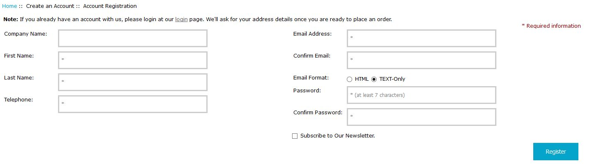

# *Create Account* Page Modifications #

When a store has enabled the *OPC*'s *registered-account* handling (setting ***Configuration->One-Page Checkout Settings->Enable Account Registration?*** to *true*), the formatting of the store's `create_account` page is modified to gather *minimal* customer information with which to create an account.  Upon click of the "Register" button (and validation of the entries), the customer's account is created &mdash; with a place-holder address-book record &mdash; and the *OPC*'s modified version of the `create_account_success` [page](create_account_success_page.md) is displayed.

The customer can optionally add an address to their account by navigating to their "Address Book".  Upon entry to the checkout-process, the customer is required to supply the address(es) to be used for their order.

----------

----------

The language-text associated with the changes is found in `includes/languages/english/create_account_register.php` and the page-template is found in `includes/templates/template_default/templates/tpl_create_account_register.php`.
