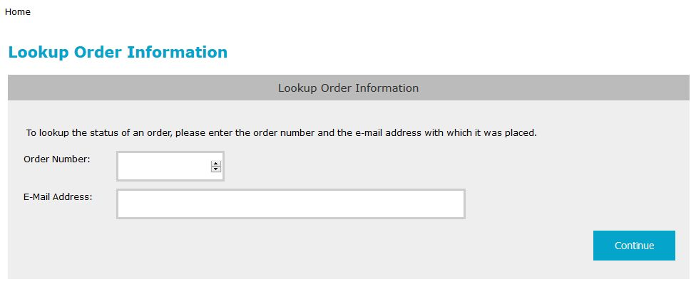
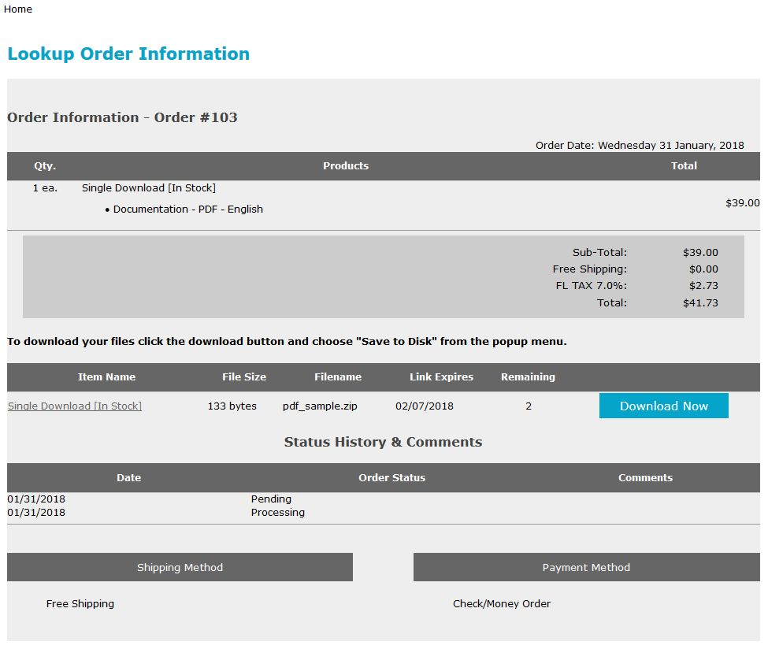

# *Order Status* Page #

The `order_status` page enables *not-logged-in* customers to view the status of an order by supplying the order number and the email-address used to place that order. 

The store's admin ***Configuration->One-Page Checkout Settings->Order Status: Slamming Control*** enables a store-owner to control the number of *back-to-back failed look-ups* as a method to reduce slamming (i.e. nefarious persons trying to find a matching order).  If a slamming situation is detected, the customer's session is destroyed.  The "failed look-up" count is reset once a matching order-number/email-address combination is found.

***Note:*** If a *logged-in* customer navigates to the `order_status` page, they'll be redirected to their `account_history` page instead.

On initial entry to the page, a form is displayed to gather the order-number and email address:

----------

----------

When a matching order-number and email-address is entered, the page displays the matching order's information.  If the order included downloadable items, the customer can download those items directly from this page.

----------

 

----------

The language-text associated with the changes is found in `includes/languages/english/order_status.php` and the page-template is found in `includes/templates/template_default/templates/tpl_order_status_default.php`.

